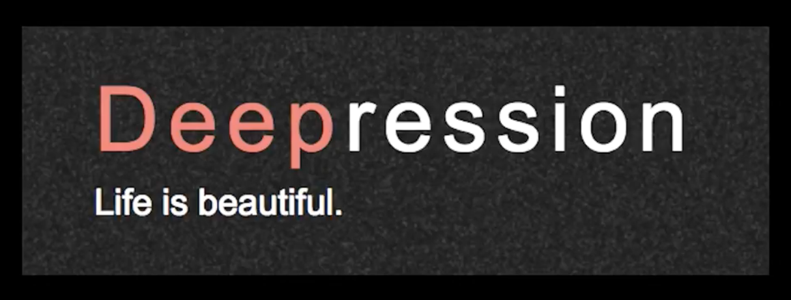

# Depression

Fighting depression using social media data and machine learning

## Angel Hackathon London (July 15th-16 2017)

Winner of the [GovTech challenge](http://govtechalliance.org/current-campaigns/) in London. Govtech Alliance's current campaign is focused on developing technologies to help foster tolerance and counter extremism.

Partnerted with [AngelHack](http://www.hackathon.io/angelhack-global-hackathon-series-london) global hackathon series.

## Project Details

During the hackathon, we built a real-time database using twitter stream data, filtered on depression phrases. We spotted influencers and their activities in depressed social circle. We will build behaviour models of the depressed user group, help support organisations to reach out to the influencers and continue to monitor and support anti-depression social change over time.

## Demo video

View the demo video [here](https://youtu.be/fUGUEETyJuU)

## What others are saying

### Articles

[Tech firm and hackers join forces to combat online extremism](https://www.linkedin.com/pulse/tech-firm-hackers-join-forces-combat-online-extremism-rosie-earl?trk=v-feed&lipi=urn%3Ali%3Apage%3Ad_flagship3_search_srp_content%3BdN2zBG8043yQSjR8vAs%2Fqw%3D%3D&lipi=urn%3Ali%3Apage%3Ad_flagship3_search_srp_content%3B0KhODRZTQv6%2BoqThgou9Fw%3D%3D) - Recognition PR

## Team Members

Marios Georgiou
Cynthia Tin
Dimitrios Spiliopoulos
Brett Nuemayer
